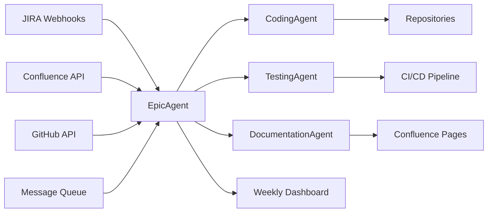

# Agentic Product Manager AI — Implementation Blueprint

## 1. Core Components

### Epic Agent
- Role: Orchestrator for each Business Epic.
- Responsibilities:
  - Monitor JIRA for new stories.
  - Filter by status = Approved.
  - Trigger sub‑agents (Coding, Testing, Documentation).
  - Consolidate progress + generate weekly digest.

### Sub‑Agents
- Coding Agent: Implements repo changes, commits via GitHub API.
- Testing Agent: Builds regression/unit tests, runs CI/CD pipelines.
- Documentation Agent: Updates Confluence pages, generates HLD/LLD diagrams.

---

## 2. Tooling & APIs

- JIRA API:
  - Webhooks for story status changes.
  - REST API for creating Epics, Stories, Spikes.

- Confluence API:
  - Auto‑generate documentation pages.
  - Embed diagrams (Mermaid, PlantUML).

- GitHub/GitLab API:
  - Repo scanning for impacted components.
  - Trigger CI/CD workflows.

- Message Queue (Kafka/RabbitMQ/Azure Service Bus):
  - Event bus for agents to subscribe to approval events.

---

## 3. Infrastructure Setup

### Deployment Options
- Kubernetes Pods:
  - Each agent runs as a microservice.
  - Always‑on, scalable.

- Serverless Functions (AWS Lambda / Azure Functions):
  - Event‑driven execution.
  - Cost‑efficient for burst workloads.

### State Management
- Database: Postgres/MongoDB/DynamoDB.
- Purpose: Track story states, approvals, execution logs.

### Security
- API Tokens: JIRA, Confluence, GitHub.
- RBAC: Ensure agents only act on approved work.
- Secrets Management: HashiCorp Vault / Azure Key Vault.

### Observability
- Logging: ELK stack (Elasticsearch, Logstash, Kibana).
- Monitoring: Prometheus + Grafana dashboards.
- Alerts: Notify if agent fails or dependency breaks.

---

## 4. Workflow Example

1. Customer logs requirement → JIRA Epic auto‑created.
2. Epic Agent scans repos → identifies impacted components.
3. Stories auto‑generated → tagged *Ready for Approval*.
4. Approval checklist sent → Architect, QA Lead, Product Owner.
5. Once approved → Epic Agent triggers sub‑agents:
   - Coding Agent commits schema changes.
   - Testing Agent runs CI/CD tests.
   - Documentation Agent updates Confluence.
6. Demo scheduled → stakeholders review.
7. Weekly digest → AI dashboard shared asynchronously.

---

## 5. Dependency Graph (Infra + Workflow)

## 6. Key Takeaways
1. Event‑Driven: Agents subscribe to JIRA approval events.
2. Governance: Approval gates ensure compliance before execution.
3. Autonomy: Sub‑agents act independently but report back to Epic Agent.
4. Scalability: Multiple Epics → multiple Epic Agents orchestrating their own workflows.
5. Traceability: Audit trail + Confluence docs ensure business/tech alignment.
